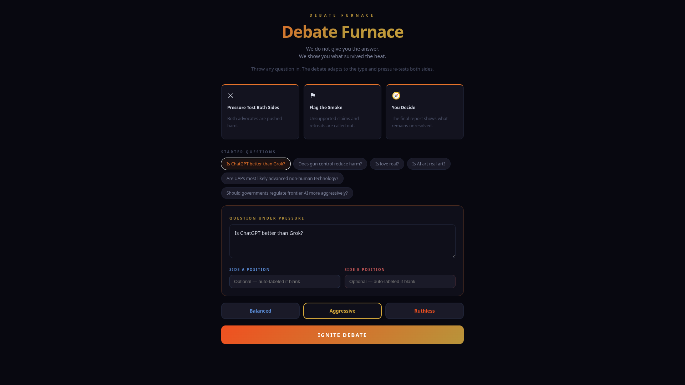

# Debate Furnace

Debate Furnace is a React argument pressure-testing app. It runs both sides of a question through structured rounds, flags weak reasoning, shows what survived the heat, and leaves the final decision with the user.

> We do not give you the answer. We show you what survived the heat.



## Features

- Question type detection
- Topic-specific debate framing
- Three debate rounds
- Smoke flags for weak reasoning
- Claim drift detection
- Final report with key takeaways
- Core Heat Point
- Decision Compass
- What Would Change the Verdict
- Copyable markdown report

## Reference docs

The current app is intentionally compact for local testing and deployment. The richer V4 script and report language is archived here:

- [Debate Furnace Rich Script Reference](docs/Debate_Furnace_Rich_Script_Reference.md)

## Local setup

```bash
npm install
npm run dev
```

## Build

```bash
npm run build
```

## Notes

This is a frontend prototype. The current debate engine is local mock logic and can be replaced later with a real model-backed evaluation engine.
