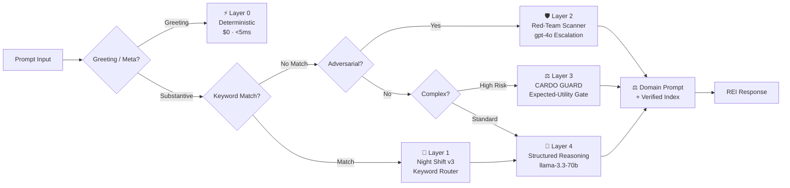

# REI.ai — Cost-Aware LLM Routing & Structured Reasoning

> **REI.ai by PromptHound Labs**  
> *"A structured reasoning framework with cost-aware LLM routing."*

REI.ai automatically minimizes LLM API costs by classifying prompts locally and routing them to the cheapest capable model before a single remote token is processed. 

---

## 📊 Performance & Testing Metrics

We prioritize verifiable, empirical benchmarks over generalized claims:

*   **90% Route Accuracy:** Verified on our fresh, 30-prompt blind holdout set for the v3 keyword router (evolving from a 67% baseline to 90% post-tuning).
*   **v4 Semantic Router (Research):** Currently at **70% accuracy** running local 384-dimensional dense vector embeddings (`all-MiniLM-L6-v2` via ONNX/WASM in browser/Node).
*   **440+ Tests:** 31 test suites with 100% pass rate — router decisions, classifier math, adversarial scanning, chat rendering, collapsible instrument rail, domain registry, and blind-holdout methodology.
*   **12 Landmark Legal Cases:** Our legal reasoning domain is grounded in a 12-case verified index to prevent hallucination.

---

## 🧠 The 5 Reasoning Domains

The routing engine classifies prompts into one of five core domains:

1.  **The Generalist (assistant):** Everyday queries, reasoning, and low-complexity tasks.
2.  **The Engineer (coding):** Advanced software logic executing the CARDO REI methodology (verifies API shapes, enforces developer checks, and halts on ambiguity).
3.  **The Archivist (genealogy):** Evidence-tiered historical records analysis (same-name disambiguation, parish registers, age boundary validation).
4.  **The Storyteller (story):** Narrative architecture and character hinge generators.
5.  **The Precedent Engine (legal):** Local precedent grounding utilizing the `Case Hinge` engine.

---

## 📐 Router Architecture & Core Components

REI's routing pipeline runs in less than 5ms locally:


```mermaid
flowchart LR
    A[Prompt Input] --> B{Greeting / Meta?}
    B -->|Greeting| C[⚡ Layer 0<br/>Deterministic<br/>$0 · &lt;5ms]
    B -->|Substantive| D{Keyword Match?}
    D -->|Match| E[🌙 Layer 1<br/>Night Shift v3<br/>Keyword Router]
    D -->|No Match| F{Adversarial?}
    F -->|Yes| G[🛡️ Layer 2<br/>Red-Team Scanner<br/>gpt-4o Escalation]
    F -->|No| H{Complex?}
    H -->|High Risk| I[⚖️ Layer 3<br/>CARDO GUARD<br/>Expected-Utility Gate]
    H -->|Standard| J[📐 Layer 4<br/>Structured Reasoning<br/>llama-3.3-70b]
    E --> J
    G --> K[⚖️ Domain Prompt<br/>+ Verified Index]
    I --> K
    J --> K
    K --> L[REI Response]
```

**6-layer cascade:**
1. **Zero-Inference Matcher** — greetings & meta return $0 local responses
2. **Night Shift v3 Router** — keyword + structural signals classify domains
3. **Red-Team Scanner** — adversarial prompts escalate to gpt-4o
4. **CARDO GUARD Gate** — cost-weighted decisions (ACT vs WAIT)
5. **Structured Reasoning** — standard queries to llama-3.3-70b
6. **Domain Prompts** — domain-specific instructions + Case Hinge legal grounding

---

## 🧠 Philosophy

REI is grounded in two principles:

- **Engelbart's H-LAM/T framework:** The artifact (router) does not replace human reasoning — it augments it. The system proposes improvements (bootstrapper suggests keywords), the human decides (review before applying). Together they close the Engelbart feedback loop.
- **Kaku's definition of intelligence:** Higher intelligence is the ability to use feedback loops to model reality. REI's eval benchmarks measure accuracy, the router improves, the gap closes. The methodology gets sharper through iteration — not through claims.

Read more: [Philosophy & Methodology](docs/README.md) · [Testing Strategy](docs/TESTING.md) · [ARCHITECTURE DECISIONS](docs/DECISIONS.md)

---

## 🌐 User Interface & Core Features

Our landing page and chat shell highlight both the flagship router and specialized reasoning tools:
*   **Interactive Router Demo:** Live playground displaying the selected model, estimated token usage, and real-time cost delta.
*   **Collapsible Instrument Rail:** Real-time desktop telemetry panel displaying session tokens, dollar savings vs. premium models, model breakdown, and efficiency metrics with compact 50px collapse mode.
*   **Optimistic Message Stream:** Instant zero-lag UI updates on message send with one-click export for formatted CARDO markdown reports.
*   **CARDO Pipeline Trace:** Full visibility into the reasoning steps (Collect, Analyze, Record, Distinguish, Operate).
*   **Vibrant Cyberpunk GUI:** Responsive glassmorphism dashboards with gold gradients and real-time telemetry metrics.

---

## 📚 Documentation

*   **[Architecture & Methodology](docs/README.md)** — Canonical doc index: information-theoretic architecture, CARDO REI framework, Night Shift router, v4 semantic research, red-team spec
*   **[Architecture Decision Records](docs/DECISIONS.md)** — Dated ADRs with trade-offs, alternatives considered, and code references
*   **[Testing Strategy](docs/TESTING.md)** — 31 suites, 443 tests, testing philosophy, how to write new tests
*   **[Contributing](CONTRIBUTING.md)** — Setup, code style, pull request checklist
*   **[Security Policy](SECURITY.md)** — Vulnerability reporting, scope

---

## 🛠️ Tech Stack & Deployment

*   **Frontend:** React (lazy-loaded code splitting, Context state), Tailwind CSS (Relume gold preset).
*   **Backend:** Node.js, Vercel Serverless Functions (`api/cfai.js`).
*   **Embeddings:** ONNX Runtime Web / WASM.
*   **Testing:** Jest (jsdom environment).

---

## ⚡ Quick Start

### 1. Clone & Install
```bash
git clone https://github.com/aaronmarchant96-max/rei-ai
cd rei-ai
npm install
```

### 2. Run Locally
```bash
npm run dev
```

### 3. Run Benchmark Suite
```bash
npm test
```

---

## 🔗 Project Links

*   **Live App:** [https://rei-ai.vercel.app/#rei](https://rei-ai.vercel.app/#rei)
*   **Production Deployment:** [https://rei-aa0e6olw1-prompthound-s-projects.vercel.app/#rei](https://rei-aa0e6olw1-prompthound-s-projects.vercel.app/#rei)
*   **Source Code:** [https://github.com/aaronmarchant96-max/rei-ai](https://github.com/aaronmarchant96-max/rei-ai)

// trigger redeploy