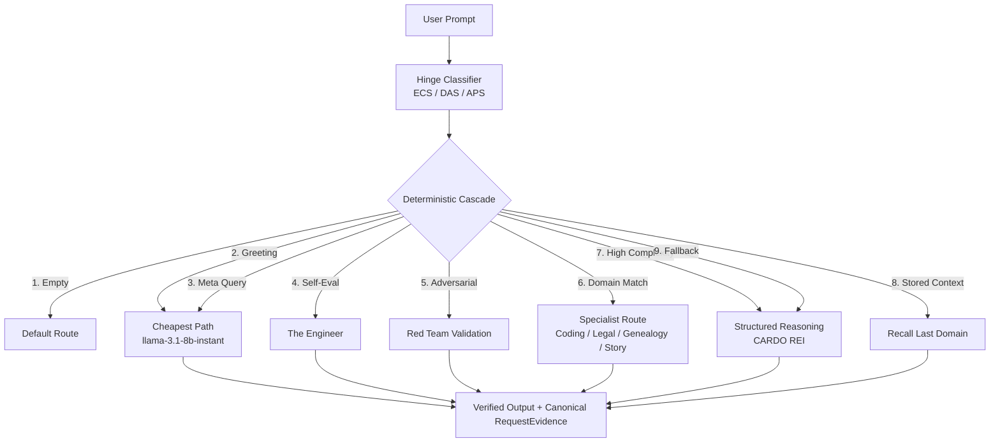

# REI.ai — An Executable Method for Building Accountable AI


> **"You're not just saving money. You're building better, faster."**
> 
> *Route each task to the right model, verify the result, and keep the evidence.*
> 
> Originally built on an Intel Celeron J4105 (8GB RAM, $25/mo budget); now running on a Lenovo ThinkPad T14 Gen 2a (AMD Ryzen 5 PRO 5650U, 16GB RAM) with a ~$60/month operating budget:
> **1.848B development & evaluation tokens processed through the OpenCode/DeepSeek build workflow for $23.52, with a 97.35% measured input-cache hit rate across 9,157 billing-export requests.**

> [!TIP]
> ### 🪝 The Bootstrap Loop
> **Are you going to try using it?**
> 
> Because the live gateway is online. When you throw a prompt at `/api/v1/chat/completions`, you’re not just a user—you’re contributing to the bootstrap loop. Your telemetry makes the router smarter. And the router getting smarter means the next person who uses it gets a better result for less money. **That's the whole point.**

---

## 📌 Table of Contents

- [What is REI.ai?](#-what-is-reiai)
- [The Evidence Loop](#-the-reiai-evidence-loop)
- [What This Is (And Isn't)](#-what-this-is-and-isnt)
- [The 6 Specialized Reasoning Domains](#-the-6-specialized-reasoning-domains)
- [How the Smart Router Works](#-how-the-smart-router-works)
- [Core Platform Engines](#-core-platform-engines)
- [Red Team — Client-Side Prompt Security Guard](#-red-team--client-side-prompt-security-guard)
- [Historical Live Endpoint Captures](#-historical-live-endpoint-captures)
- [OpenAI-Compatible Cognitive Proxy](#-openai-compatible-cognitive-proxy-v1chatcompletions)
- [About the Builder](#-about-the-builder)
- [Quick Start](#-quick-start)
- [Live Links & Documentation](#-live-links--documentation)

---

## 🎯 What is REI.ai?

**REI is a method for making AI decisions accountable.** Before an AI system sends a request, accepts an answer, or claims savings, it asks five questions: What is the job? Which model should handle it? What rules must the answer follow? Did it finish correctly? Can we prove what happened and what it cost?

The product has four parts:

- **REI Method** — the repeatable five-question standard.
- **REI Engine** — the control layer that applies the method inside an AI product.
- **REI Studio** — the live workspace where people use REI and inspect its decisions.
- **REI Decision Audit** — a bounded first engagement that finds missing routing rules, quality contracts, delivery checks, and evidence before a team replaces its stack.

The OpenAI-compatible FinOps proxy and dynamic inference router (`/v1/chat/completions`) is the first production implementation of the method. It can sit in front of agents, coding assistants, and backend pipelines to choose an eligible model and return an auditable receipt. **CARDO** is the formal execution cycle under the hood.

Backed by **1,366 automated tests across 121 test suites**, all passing in the latest local verification on 2026-09-02.

```text
┌─────────────────────────────────────────────────────────────────────────────┐
│                          THE REI.AI EVIDENCE LOOP                           │
├─────────────────────────────────────────────────────────────────────────────┤
│ Give us a request ──► Watch what we do ──► Inspect why we did it ──►        │
│                       See what it cost  ──► Verify the claim                │
└─────────────────────────────────────────────────────────────────────────────┘
```

---

## 📊 What This Is (And Isn't)

**What this is:**
- **A Deterministic AI Router & OpenAI Proxy:** Inspects prompt semantics locally and recommends a lower-cost eligible model under explicit routing policy. Serves standard OpenAI-compatible `/v1/chat/completions` for agent integration. See [docs/CLAIM_LEDGER.md](docs/CLAIM_LEDGER.md) for current benchmark numbers, denominators, exclusions, and producing commands.
- **Evidence & Provenance Architecture:** Emits canonical `RequestEvidence` objects downstream of execution with explicit epistemic tiers (`observed`, `derived`, `modeled`, `replayed`, `unavailable`). Missing telemetry renders "Evidence unavailable" — zero substitution of `$0.00`.
- **Prompt-Freeze & Deterministic Caching Protocol:** Sustains an **88.0% reconstructed effective prompt cache ratio** (136.2M cached / 154.7M input tokens across $N=1,500$ reconstructed model turns) by freezing prefix order and generating SHA-256 deterministic cache keys. [See caching protocol](docs/CACHING_RULES.md).
- **CARDO REI Reasoning Framework:** Enforces structured decision-making that separates verified facts from assumptions.
- **Instance-Local Single-Flight & Provider Concurrency Pools:** Coalesces in-flight identical non-streaming requests (`stream: false`) per tenant using SHA-256 canonical hashing while managing bounded concurrency pools for Gemini and Groq (`maxConcurrent: 4`, `maxQueueDepth: 20`).
- **Delivery Integrity Gate (`delivery-gated-v1`):** Validates transport completion, finish reason normalization (`stop`), raw vs. display parse parity, code fence balance, and explicit artifact contracts. Incomplete or truncated responses are marked `savingsEligibility: "excluded"` and contribute `$0.00` to eligible savings.
- **Anti-Slop & De-Roboticize Pipeline:** Locally detects and strips buzzword padding, corporate boilerplate, and AI hedging.
- **Night Shift Routing:** Classifies each request locally and selects a route with an explicit model, token ceiling, quality gate, and cost estimate.
- **Five Registered Reasoning Domains plus Debate:** General Chat, Coding & Architecture, Historical Genealogy, Legal Precedent Analysis, and Storytelling are registered in the central domain catalog; Debate & Critical Pressure-Testing is maintained as a separate module.
- **Empirical Rigor:** Backed by 1,366 automated tests across 121 test suites in the latest local run, with a fast local test loop (`npm run test:fast` / `jest --maxWorkers=50%`) on ThinkPad T14 Gen 2a.

**What this is not:**
- Just another standard ChatGPT wrapper with a UI reskin.
- A VC-funded startup backed by a venture team.
- Over-hyped software with unmeasured or fabricated claims.

---

## 🧠 The 6 Specialized Reasoning Domains

REI.ai automatically detects task intent and dispatches to specialized reasoning contexts:

1. **The Engineer** — Coding architecture, algorithmic logic, TypeScript refactoring, and step-by-step implementation plans.
2. **The Precedent Engine** — Legal analysis and regulatory risk synthesis grounded in a verified 12-case historical index.
3. **The Archivist** — Evidence-tiered genealogical research, document transcription, and conflict resolution.
4. **The Critical Inquirer (Debate)** — Dialectical pressure-testing, argument stress-testing, and counterfactual validation.
5. **The Storyteller** — Creative narrative design, character arc consistency, and world-building mechanics.
6. **The Generalist** — Multi-domain everyday problem solving, synthesis, and rapid query dispatch.

---

## 📐 How the Smart Router Works

Instead of blindly sending every request to expensive flagship models, REI runs a **deterministic 9-stage decision cascade** locally:


```mermaid
flowchart TD
    A["User Prompt"] --> B["Hinge Classifier<br>ECS / DAS / APS"]
    B --> C{"Deterministic Cascade"}
    C -->|"1. Empty"| D["Default Route"]
    C -->|"2. Greeting"| E["Cheapest Path<br>llama-3.1-8b-instant"]
    C -->|"3. Meta Query"| E
    C -->|"4. Self-Eval"| F["The Engineer"]
    C -->|"5. Adversarial"| G["Red Team Validation"]
    C -->|"6. Domain Match"| H["Specialist Route<br>Coding / Legal / Genealogy / Story"]
    C -->|"7. High Complexity"| I["Structured Reasoning<br>CARDO REI"]
    C -->|"8. Stored Context"| J["Recall Last Domain"]
    C -->|"9. Fallback"| I
    E --> K["Verified Output + Canonical RequestEvidence"]
    F --> K
    G --> K
    H --> K
    I --> K
    J --> K
```

### Why Order Matters
Cascade priority is economically optimized: simple greetings use the low-cost path, while adversarial and security-sensitive requests are evaluated before ordinary shortcuts.

---

## ⚡ Core Platform Engines

### 1. The Evidence & Live Demonstration Layer (`src/lib/evidenceEngine.ts`)
- **Downstream-Only Observer:** Strictly normalizes execution traces without re-running classification or routing.
- **Telemetry Capsule:** Displays real-time model badge, observed cost (`(Observed)`), modeled flagship baseline (`(Modeled — GPT-4o)`), and derived savings (`(Derived)`).
- **"Why This Route?" Inspector:** Reveals the task classification, complexity score, adversarial scan result, and exact selection constraints.
- **Trace-Driven Route Stepper:** Renders only recorded stages; unrecorded rules display `"Rule: Not recorded in trace"` (zero cosmetic fabrication).
- **Baseline vs. CARDO Comparator:** Objective before/after comparison tracking hedge marker counts and structured fact separation.

### 2. Night Shift Batch Router (`src/lib/nightShiftRouter.ts`)
- Automatically identifies asynchronous, non-blocking background tasks (evaluations, document indexations, batch summaries).
- Batches and dispatches jobs during provider off-peak pricing windows and available free-tier token allocations.

### 3. Anti-Slop & De-Roboticize Filter (`src/lib/detectAISlop.js`, `src/lib/deRoboticize.js`)
- Scans model outputs for hollow corporate AI buzzwords (*"delve"*, *"testament"*, *"tapestry"*, *"vital role"*) and passive hedge phrases.
- Enforces concise, direct, human-first writing.

### 4. Evaluating the Evaluator (Meta-Evaluation Loop)
REI tracks the reliability of its own defenses over time:
```text
Architecture ──> Router ──> Evaluation ──> Error Gaps ──> [caught: tag] ──> Error Catalogue ──> Better System
```
Every bugfix or test failure logs a machine-parseable tag (`[caught: test]`, `[caught: ai-cross-check]`, `[caught: manual]`), generating a living dataset in `docs/ERROR_GAP_CATALOGUE.md` showing which layers catch defects.

---

## 🔴 Red Team — Client-Side Prompt Security Guard

The Red Team tab is a zero-cost, in-browser security scanner that inspects prompts for jailbreaks, prompt injection, or policy bypass attempts **before any API call is made**.

- **100% Private & Zero Cost:** Runs in-browser pattern checks without consuming API tokens.
- **Defines 16 Threat Categories:** The current fixed 12-case regression corpus exercises 11 categories and routes 12/12 cases correctly; this is bounded fixture evidence, not a universal detection-rate claim.
- **Model Agnostic:** Works as a pre-flight firewall for OpenAI, Anthropic, Gemini, Groq, or local Ollama endpoints.

---

## 🌐 Historical Live Endpoint Captures

<details>
<summary><strong>🔍 Click to Expand Point-in-Time Production Endpoint Captures</strong></summary>

<br>

The following point-in-time captures were recorded against the production endpoint (`https://prompthound-labs.vercel.app/api/cfai`). They are retained as historical observations and are not a current uptime or model-availability claim:

### 1. Direct Low-Latency Routing (Groq `openai/gpt-oss-120b`)
- **Query:** *"What is the capital of France? Answer in 3 words."*
- **Execution:** Routed to `openai/gpt-oss-120b` via Groq in 0.12s.
- **Telemetry:** `334 prompt tokens`, `96 completion tokens` (`430 total`).
- **Receipt:** Attached to message as `(Observed)` with $0.00004 cost.

### 2. Specialized Coding Reasoning (Gemini `gemini-3.6-flash`)
- **Query:** *"Explain what a database index is in 1 sentence."*
- **Execution:** Dispatched to `gemini-3.6-flash` with CARDO structured gates.
- **Telemetry:** `181 prompt tokens`, `40 completion tokens` (`568 total`).

### 3. Autonomous Exa Neural Search Loop (`web_search` Tool Calling)
- **Query:** *"Search the web for the winner and final score of Super Bowl LVIII."*
- **Autonomous Action:** Model detected real-time sports query requirement, invoked `web_search`, called Exa Search API (`https://api.exa.ai/search`), parsed token-efficient neural highlights, and returned the verified answer:
  > *"The Kansas City Chiefs won Super Bowl LVIII, defeating the San Francisco 49ers with a final score of 25–22 in overtime on February 11, 2024."*
- **Telemetry:** `1,456 prompt tokens`, `46 completion tokens` (`1,848 total`).

</details>

---

## 🔌 OpenAI-Compatible Cognitive Proxy (`/v1/chat/completions`)

REI.ai runs as a drop-in local model proxy gateway for any agent, CLI, or IDE extension (Cursor, Cline, Agy, Aider, OpenCode) supporting the OpenAI API specification:

```bash
# 1. Start the local cognitive proxy (port 3000)
npm run server

# 2. Configure your agent / CLI environment
export OPENAI_BASE_URL="http://localhost:3000/v1"
export OPENAI_API_KEY="local-dev-key"

# 3. Pass model="rei-auto"
# - Routine shell checks, status polls, and small diffs route to LLaMA 3.1 8B ($0.05/MTok)
# - Standard refactors and tests route to GPT-OSS 20B ($0.15/MTok)
# - High-complexity architectural plans escalate to GPT-OSS 120B / Gemini ($0.90/MTok)
# - Deep algorithmic reasoning escalates to DeepSeek Reasoner
```

---

## 👤 About the Builder

| Metric | Value |
| :--- | :--- |
| Verified DeepSeek Build-Workflow Spend | **$23.5172** *(2026-07-20 through 2026-08-14 billing export)* |
| Tokens Processed | **1.84+ billion** |
| Specialized Domains | **6 application reasoning modes** |
| Automated Tests | **1366 passing tests across 121 suites** |
| GitHub Deployment Records | **1,495 records** *(GitHub API, observed 2026-09-02; not a claim that every record was a successful production release)* |
| Development Hardware | Lenovo ThinkPad T14 Gen 2a (Ryzen 5 PRO 5650U, 16GB RAM) *(orig. Celeron J4105)* |
| Monthly Operating Budget | ~$60/month *(expanded evaluation & tool testing volume)* |
| In-Memory Route Resolution | Deterministic; fresh latency benchmark required before publishing a numeric ceiling |

---

## 🛠️ Quick Start

```bash
# Clone the repository
git clone https://github.com/aaronmarchant96-max/rei-ai.git
cd rei-ai

# Install dependencies
npm install

# Start development server
npm run dev

# Or run with full client-server sync
npm run dev:full

# Or run the headless cognitive proxy gateway alone
npm run server

# Run fast test loop (~11.4s on 12-thread machine via 50% maxWorkers)
npm run test:fast

# Run serial test suite (121 test suites, 1366 tests)
npm test

# Run offline counterfactual replay simulator (zero API spend)
npx tsx scripts/replay-cost-savings.mjs
```

---

## 🔗 Live Links & Documentation

- **Live Application:** [https://prompthound-labs.vercel.app/#rei](https://prompthound-labs.vercel.app/#rei)
- **Source Repository:** [https://github.com/aaronmarchant96-max/rei-ai](https://github.com/aaronmarchant96-max/rei-ai)
- **Architecture & Governance:** [Defense-in-Depth Control Matrix](docs/DEFENSE_IN_DEPTH_CONTROL_MATRIX.md) · [Architecture Spec](docs/ARCHITECTURE.md) · [Testing Strategy](docs/TESTING.md) · [Claim Ledger](docs/CLAIM_LEDGER.md) · [Decisions (ADR)](docs/DECISIONS.md) · [Error Gap Catalogue](docs/ERROR_GAP_CATALOGUE.md)

---

*Built in 2026 by Aaron Marchant. Self-taught. One machine.*
