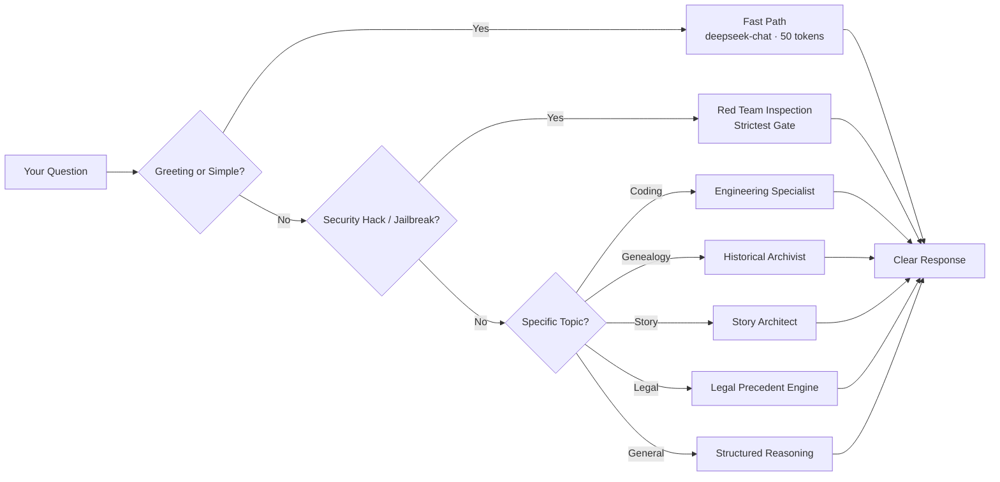

# REI.ai — Smart AI Routing & Structured Reasoning

> **"The future of AI isn't just about better models — it's about better systems."**
>
> Built by a self-taught developer who started building AI systems in 2026.
> No CS degree. No tech background. Just a $25/month budget, an Intel Celeron J4105 with 8GB RAM, and a question: *can one person build something real in AI this year?*

REI.ai is the answer — a smart, budget-friendly AI system that reads your prompts locally and routes them to the cheapest model capable of giving a great answer. 

It includes **6 specialized tools** and **677 automated test checks** ensuring everything stays fast, accurate, and cost-effective.

---

## 📊 What This Is (And Isn't)

**What this is:**
- **A Smart AI Traffic Controller:** Saves up to ~98% on AI API costs compared to always using expensive models like GPT-4o by picking the right model for the job.
- **A Structured Thinking Engine:** Uses a clear, step-by-step framework (CARDO REI) to separate facts from assumptions and give clear reasoning.
- **A Suite of 6 Specialized Tools:** Includes tools for debate pressure-testing, storytelling, legal precedent checks, industrial monitoring, genealogy, and everyday AI chat.
- **Battle-Tested Code:** Backed by 677 automated unit tests across 57 test suites to ensure routing and security logic never drift.

**What this is not:**
- Just another standard ChatGPT clone with a pretty interface.
- A VC-funded startup backed by a huge team of engineers.
- Over-hyped software with unverified claims.

---

## 🧠 The 5 AI Reasoning Tools

REI.ai automatically detects what kind of task you are working on and directs it to the right specialized prompt:

1. **The Generalist** — Everyday decision-making, clear advice, and logical problem-solving.
2. **The Engineer** — Coding logic, software structure, and step-by-step architecture planning.
3. **The Archivist** — Historical record analysis and evidence-backed family tree research.
4. **The Storyteller** — Creative writing, plot structures, and character development.
5. **The Precedent Engine** — Legal case analysis grounded in a verified 12-case index.

---

## 📐 How the Smart Router Works

Instead of sending every request straight to expensive cloud servers, REI's router checks the prompt locally on your computer first using fast keyword and structural rules.


```mermaid
flowchart LR
    A[Your Question] --> B{Greeting or Simple?}
    B -->|Yes| C[Fast Path<br/>deepseek-chat · 50 tokens]
    B -->|No| D{Security Hack / Jailbreak?}
    D -->|Yes| E[Red Team Inspection<br/>Strictest Gate]
    D -->|No| F{Specific Topic?}
    F -->|Coding| G[Engineering Specialist]
    F -->|Genealogy| H[Historical Archivist]
    F -->|Story| I[Story Architect]
    F -->|Legal| J[Legal Precedent Engine]
    F -->|General| K[Structured Reasoning]
    C --> N[Clear Response]
    E --> N
    G --> N
    H --> N
    I --> N
    J --> N
    K --> N
```

**Decision Order:**
1. **Greetings & Quick Questions:** Handled instantly using a tiny 50-token budget.
2. **Security & Red Team Checks:** Catches trick prompts or policy bypasses before doing anything else.
3. **Topic Match:** Directs coding, legal, story, or genealogy questions to the right specialist.
4. **General Questions:** Handled by a balanced reasoning engine.

---

## 🔴 Red Team — Instant Prompt Security Guard

The Red Team tab is a free, instant security scanner that inspects your prompt for hacks, jailbreak attempts, or policy bypasses **right inside your browser**.

### Why it matters:
- **Zero Cost & Private:** Runs 100% in your browser using local pattern checks — no data leaves your machine and zero API tokens are wasted.
- **Catches 14 Attack Types:** Flags prompt extraction, identity spoofing, credential leaks, hidden ciphers, and roleplay tricks.
- **Works for Any AI Engine:** Useful whether you are using OpenAI, Anthropic, DeepSeek, or local open-source models.

---

## 🧠 Philosophy

REI is built on a core belief: **the future of AI isn't just about better models — it's about better systems.**

- **Augmenting Human Judgment:** Technology should help people think better, not replace human judgment. The system suggests options; the human decides.
- **Verifiable Truth:** Every claim or cost-saving metric in this system is backed by reproducible tests you can run yourself in terminal.

---

## 👤 About the Builder

I started learning software and AI development in 2026. This project is the result of ~4 months of focused building under real-world constraints:

| Metric | Value |
|--------|-------|
| Total API Spend | **$14.66** |
| Tokens Processed | **1.35 billion** |
| Tools Built | **6 specialized applications** |
| Automated Tests | **677 passing tests across 57 suites** |
| Hardware Used | Intel Celeron J4105, 8GB RAM |
| Monthly Budget | $25/month |
| Background | Self-taught, started late 2025/early 2026 |

---

## 🛠️ Quick Start

Want to run it locally or run the test suite?

```bash
git clone https://github.com/aaronmarchant96-max/rei-ai
cd rei-ai
npm install
npm run dev      # Launch local web interface
npm test         # Run all 677 automated tests
```

---

## 🔗 Live Links & Docs

- **Live Application:** [https://prompthound-labs.vercel.app/#rei](https://prompthound-labs.vercel.app/#rei)
- **Source Code:** [github.com/aaronmarchant96-max/rei-ai](https://github.com/aaronmarchant96-max/rei-ai)
- **Documentation:** [Architecture & Methodology](docs/README.md) · [Testing Strategy](docs/TESTING.md) · [ADR Log](docs/DECISIONS.md)

---

*Built in 2026 by Aaron Marchant. Self-taught. One machine.*
