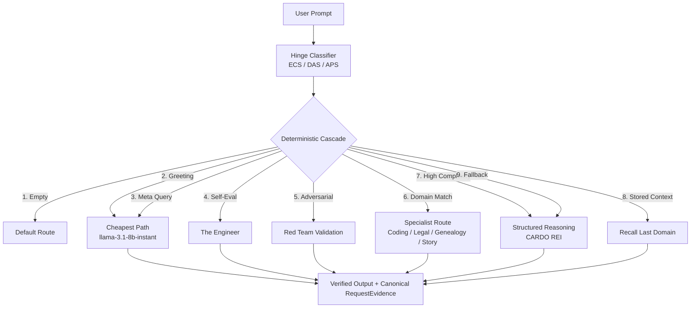

# REI.ai — Smart AI Routing & Structured Reasoning

> **"You're not just saving money. You're building better, faster."**
> 
> *Route each task to the right model, verify the result, and keep the evidence.*
> 
> Built by a self-taught developer who started building AI systems in 2026.
> No CS degree. No tech background. Just a $25/month budget, an Intel Celeron J4105 with 8GB RAM, and a question: *can one person build something real in AI this year?*

REI.ai is the answer — a deterministic AI orchestration platform that inspects prompts locally and routes each request to the cheapest model capable of producing high-quality reasoning.

Backed by **975 automated tests across 80 test suites** (generated from the test runner), REI.ai enforces verifiable cost savings, anti-slop verification, prompt-cache optimization, and client-side security.

```text
┌─────────────────────────────────────────────────────────────────────────────┐
│                          THE REI.AI EVIDENCE LOOP                           │
├─────────────────────────────────────────────────────────────────────────────┤
│ Give us a request ──► Watch what we do ──► Inspect why we did it ──►        │
│                       See what it cost  ──► Verify the claim                │
└─────────────────────────────────────────────────────────────────────────────┘
```

---

## 📊 What This Is (And Isn't)

**What this is:**
- **A Deterministic AI Router & OpenAI Proxy:** Inspects prompt semantics locally and routes to the cheapest capable model. Serves standard OpenAI-compatible `/v1/chat/completions` for drop-in agent integration. See [docs/CLAIM_LEDGER.md](docs/CLAIM_LEDGER.md) for exact benchmark numbers and producing commands.
- **Evidence & Provenance Architecture:** Emits canonical `RequestEvidence` objects downstream of execution with explicit epistemic tiers (`observed`, `derived`, `modeled`, `replayed`, `unavailable`). Missing telemetry renders "Evidence unavailable" — zero substitution of `$0.00`.
- **Prompt-Freeze & Deterministic Caching Protocol:** Sustains an **88.0% reconstructed effective prompt cache ratio** (136.2M cached / 154.7M input tokens across $N=1,500$ reconstructed model turns; provenance: *reconstructed development telemetry*, reconciliation: *pending provider billing*) by freezing prefix order and generating SHA-256 deterministic cache keys. [See caching protocol](docs/CACHING_RULES.md).
- **CARDO REI Reasoning Framework:** Enforces structured decision-making that separates verified facts from assumptions.
- **Anti-Slop & De-Roboticize Pipeline:** Locally detects and strips buzzword padding, corporate boilerplate, and AI hedging.
- **Night Shift Routing:** Classifies each request locally and selects a route with an explicit model, token ceiling, quality gate, and cost estimate.
- **A Suite of 6 Specialized Tool Domains:** Coding & Architecture, Historical Genealogy, Legal Precedent Analysis, Debate & Critical Pressure-Testing, Storytelling, and General Chat.
- **Empirical Rigor:** Backed by 975 automated tests across 80 test suites to catch routing, security, and cost-contract regressions.

**What this is not:**
- Just another standard ChatGPT wrapper with a UI reskin.
- A VC-funded startup backed by a venture team.
- Over-hyped software with unmeasured or fabricated claims.

---

## 🧠 The 6 Specialized Reasoning Domains

REI.ai automatically detects task intent and dispatches to specialized reasoning contexts:

1. **The Engineer** — Coding architecture, algorithmic logic, TypeScript refactoring, and step-by-step implementation plans.
2. **The Precedent Engine** — Legal analysis and regulatory risk synthesis grounded in a verified 12-case historical index.
3. **The Archivist** — Evidence-tiered genealogical research, document transcription, and conflict resolution.
4. **The Critical Inquirer (Debate)** — Dialectical pressure-testing, argument stress-testing, and counterfactual validation.
5. **The Storyteller** — Creative narrative design, character arc consistency, and world-building mechanics.
6. **The Generalist** — Multi-domain everyday problem solving, synthesis, and rapid query dispatch.

---

## 📐 How the Smart Router Works

Instead of blindly sending every request to expensive flagship models, REI runs a **deterministic 9-stage decision cascade** locally:


```mermaid
flowchart TD
    A[User Prompt] --> B[Hinge Classifier<br/>ECS / DAS / APS]
    B --> C{Deterministic Cascade}
    C -->|1. Empty| D[Default Route]
    C -->|2. Greeting| E[Cheapest Path<br/>llama-3.1-8b-instant]
    C -->|3. Meta Query| E
    C -->|4. Self-Eval| F[The Engineer]
    C -->|5. Adversarial| G[Red Team Validation]
    C -->|6. Domain Match| H[Specialist Route<br/>Coding / Legal / Genealogy / Story]
    C -->|7. High Complexity| I[Structured Reasoning<br/>CARDO REI]
    C -->|8. Stored Context| J[Recall Last Domain]
    C -->|9. Fallback| I
    E --> K[Verified Output + Canonical RequestEvidence]
    F --> K
    G --> K
    H --> K
    I --> K
    J --> K
```

### Why Order Matters
Cascade priority is economically optimized: simple greetings use the low-cost path, while adversarial and security-sensitive requests are evaluated before ordinary shortcuts.

---

## ⚡ Core Platform Engines

### 1. The Evidence & Live Demonstration Layer (`src/lib/evidenceEngine.ts`)
- **Downstream-Only Observer:** Strictly normalizes execution traces without re-running classification or routing.
- **Telemetry Capsule:** Displays real-time model badge, observed cost (`(Observed)`), modeled flagship baseline (`(Modeled — GPT-4o)`), and derived savings (`(Derived)`).
- **"Why This Route?" Inspector:** Reveals the task classification, complexity score, adversarial scan result, and exact selection constraints.
- **Trace-Driven Route Stepper:** Renders only recorded stages; unrecorded rules display `"Rule: Not recorded in trace"` (zero cosmetic fabrication).
- **Baseline vs. CARDO Comparator:** Objective before/after comparison tracking hedge marker counts and structured fact separation.

### 2. Night Shift Batch Router (`src/lib/nightShiftRouter.ts`)
- Automatically identifies asynchronous, non-blocking background tasks (evaluations, document indexations, batch summaries).
- Batches and dispatches jobs during provider off-peak pricing windows and available free-tier token allocations.

### 3. Anti-Slop & De-Roboticize Filter (`src/lib/detectAISlop.js`, `src/lib/deRoboticize.js`)
- Scans model outputs for hollow corporate AI buzzwords (*"delve"*, *"testament"*, *"tapestry"*, *"vital role"*) and passive hedge phrases.
- Enforces concise, direct, human-first writing.

### 4. Evaluating the Evaluator (Meta-Evaluation Loop)
REI tracks the reliability of its own defenses over time:
```text
Architecture ──> Router ──> Evaluation ──> Error Gaps ──> [caught: tag] ──> Error Catalogue ──> Better System
```
Every bugfix or test failure logs a machine-parseable tag (`[caught: test]`, `[caught: ai-cross-check]`, `[caught: manual]`), generating a living dataset in `docs/ERROR_GAP_CATALOGUE.md` showing which layers catch defects.

---

## 🔴 Red Team — Client-Side Prompt Security Guard

The Red Team tab is a zero-cost, in-browser security scanner that inspects prompts for jailbreaks, prompt injection, or policy bypass attempts **before any API call is made**.

- **100% Private & Zero Cost:** Runs in-browser pattern checks without consuming API tokens.
- **Catches 14 Attack Vectors:** Flags prompt extraction, identity spoofing, credential leaking, base64 ciphers, and recursive jailbreaks.
- **Model Agnostic:** Works as a pre-flight firewall for OpenAI, Anthropic, Gemini, Groq, or local Ollama endpoints.

---

## 🌐 Verified Live Endpoints & Autonomous Tool Execution

Real-world verification runs against the production endpoint (`https://prompthound-labs.vercel.app/api/cfai`):

### 1. Direct Low-Latency Routing (Groq `openai/gpt-oss-120b`)
- **Query:** *"What is the capital of France? Answer in 3 words."*
- **Execution:** Routed to `openai/gpt-oss-120b` via Groq in 0.12s.
- **Telemetry:** `334 prompt tokens`, `96 completion tokens` (`430 total`).
- **Receipt:** Attached to message as `(Observed)` with $0.00004 cost.

### 2. Specialized Coding Reasoning (Gemini `gemini-3.6-flash`)
- **Query:** *"Explain what a database index is in 1 sentence."*
- **Execution:** Dispatched to `gemini-3.6-flash` with CARDO structured gates.
- **Telemetry:** `181 prompt tokens`, `40 completion tokens` (`568 total`).

### 3. Autonomous Exa Neural Search Loop (`web_search` Tool Calling)
- **Query:** *"Search the web for the latest Super Bowl score and report the winner in 1 sentence."*
- **Autonomous Action:** Model detected real-time query requirement, invoked `web_search`, called Exa Search API (`https://api.exa.ai/search`), parsed token-efficient neural highlights, and returned the verified answer:
  > *"The Seattle Seahawks won the latest Super Bowl by defeating the New England Patriots with a final score of 29–13."*
- **Telemetry:** `1,456 prompt tokens`, `46 completion tokens` (`1,848 total`).

---

## 🔌 OpenAI-Compatible Cognitive Proxy (`/v1/chat/completions`)

REI.ai runs as a drop-in local model proxy gateway for any agent, CLI, or IDE extension (Cursor, Cline, Agy, Aider, OpenCode) supporting the OpenAI API specification:

```bash
# 1. Start the local cognitive proxy (port 3000)
npm run server

# 2. Configure your agent / CLI environment
export OPENAI_BASE_URL="http://localhost:3000/v1"
export OPENAI_API_KEY="local-dev-key"

# 3. Pass model="rei-auto"
# - Routine shell checks, status polls, and small diffs route to LLaMA 3.1 8B ($0.05/MTok)
# - Standard refactors and tests route to GPT-OSS 20B ($0.15/MTok)
# - High-complexity architectural plans escalate to GPT-OSS 120B / Gemini ($0.90/MTok)
# - Deep algorithmic reasoning escalates to DeepSeek Reasoner
```

---

## 👤 About the Builder

| Metric | Value |
| :--- | :--- |
| Total API Spend | **$14.66** |
| Tokens Processed | **1.84+ billion** |
| Specialized Domains | **6 application reasoning modes** |
| Automated Tests | **975 passing tests across 80 suites** |
| Deployments | **1,000+ Vercel production deployments** |
| Development Hardware | Intel Celeron J4105, 8GB RAM |
| Monthly Operating Budget | $25/month |
| In-Memory Route Resolution | < 1 millisecond |

---

## 🛠️ Quick Start

```bash
# Clone the repository
git clone https://github.com/aaronmarchant96-max/rei-ai.git
cd rei-ai

# Install dependencies
npm install

# Start development server
npm run dev

# Or run with full client-server sync
npm run dev:full

# Or run the headless cognitive proxy gateway alone
npm run server

# Run full test suite (80 test suites, 975 tests)
npm test

# Run offline counterfactual replay simulator (zero API spend)
npx tsx scripts/replay-cost-savings.mjs
```

---

## 🔗 Live Links & Documentation

- **Live Application:** [https://prompthound-labs.vercel.app/#rei](https://prompthound-labs.vercel.app/#rei)
- **Source Repository:** [https://github.com/aaronmarchant96-max/rei-ai](https://github.com/aaronmarchant96-max/rei-ai)
- **Architecture & Governance:** [Defense-in-Depth Control Matrix](docs/DEFENSE_IN_DEPTH_CONTROL_MATRIX.md) · [Architecture Spec](docs/ARCHITECTURE.md) · [Testing Strategy](docs/TESTING.md) · [Claim Ledger](docs/CLAIM_LEDGER.md) · [Decisions (ADR)](docs/DECISIONS.md) · [Error Gap Catalogue](docs/ERROR_GAP_CATALOGUE.md)

---

*Built in 2026 by Aaron Marchant. Self-taught. One machine.*
