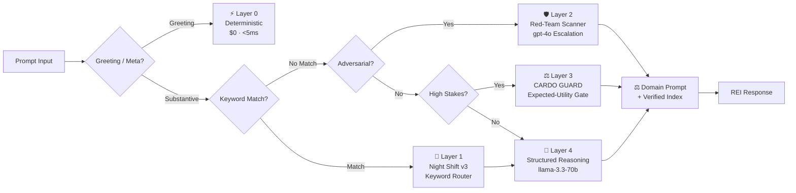

# REI.ai — Structured Reasoning & Cost-Aware LLM Routing

> **Built by a self-taught developer who started building AI systems in 2026.**
>
> No CS degree. No tech background. Just a $25/month budget, an Intel Celeron J4105 with 8GB RAM, and a question: *can one person build something real in AI this year?*

REI.ai is the answer — a structured reasoning framework that automatically classifies prompts locally and routes them to the cheapest capable model. 1.35 billion tokens processed. $14.66 total API cost. Six tools shipped. 440+ tests.

---

## 📊 What This Is (And Isn't)

**This is:**
- An explicit, testable router that saves 68–84% on LLM API costs by choosing the right model for each prompt
- A reasoning shell grounded in the CARDO REI methodology: find the hinge, separate facts from assumptions, name what would change the answer
- A portfolio of 6 specialized tools (debate pressure-testing, narrative architecture, legal precedent analysis, industrial telemetry, genealogy, and the general-purpose REI chat engine)
- 440+ tests across 31 suites — routing decisions, classifier math, adversarial scanning, blind-holdout evaluations

**This is not:**
- Another ChatGPT wrapper with a nice UI
- A VC-funded startup with a team of engineers
- A product with paying users (yet)

---

## 🧠 The 5 Reasoning Domains

The routing engine classifies prompts into one of five core domains:

1. **The Generalist** — Everyday reasoning, judgment, and decision support
2. **The Engineer** — Software architecture and coding logic (CARDO REI methodology, Phase 0 questioning)
3. **The Archivist** — Evidence-tiered genealogy and historical records analysis
4. **The Storyteller** — Narrative architecture and character hinge generators
5. **The Precedent Engine** — Legal case analysis grounded in a 12-case verified index

---

## 📐 Router Architecture

REI's routing pipeline runs in less than 5ms locally. Here's how it decides which model to call:


```mermaid
flowchart LR
    A[Prompt Input] --> B{Greeting / Meta?}
    B -->|Greeting| C[⚡ Layer 0<br/>Deterministic<br/>$0 · &lt;5ms]
    B -->|Substantive| D{Keyword Match?}
    D -->|Match| E[🌙 Layer 1<br/>Night Shift v3<br/>Keyword Router]
    D -->|No Match| F{Adversarial?}
    F -->|Yes| G[🛡️ Layer 2<br/>Red-Team Scanner<br/>gpt-4o Escalation]
    F -->|No| H{High Stakes?}
    H -->|Yes| I[⚖️ Layer 3<br/>CARDO GUARD<br/>Expected-Utility Gate]
    H -->|No| J[📐 Layer 4<br/>Structured Reasoning<br/>llama-3.3-70b]
    E --> J
    G --> K[⚖️ Domain Prompt<br/>+ Verified Index]
    I --> K
    J --> K
    K --> L[REI Response]
```

**6-layer cascade:**
1. **Zero-Inference Matcher** — greetings & meta return $0 local responses
2. **Night Shift v3 Router** — keyword + structural signals classify domains
3. **Red-Team Scanner** — adversarial prompts escalate to gpt-4o premium
4. **CARDO GUARD Gate** — cost-weighted decisions (ACT vs WAIT)
5. **Structured Reasoning** — standard queries to llama-3.3-70b
6. **Domain Prompts** — domain-specific instructions with verified-index grounding

---

## 🧠 Philosophy

REI is grounded in two principles:

- **Engelbart's H-LAM/T framework:** The system does not replace human reasoning — it augments it. The router proposes, the human decides. Together they close the feedback loop.
- **Kaku's definition of intelligence:** Higher intelligence is the ability to use feedback loops to model reality. REI's eval benchmarks measure accuracy, the router improves, the gap closes.

Read more: [Architecture & Methodology](docs/README.md) · [ADR Log](docs/DECISIONS.md) · [Testing Strategy](docs/TESTING.md)

---

## 👤 About the Builder

I started 2026 with zero AI engineering experience. No CS degree, no bootcamp, no tech job. I learned by building.

This repo represents ~4 months of work:

| Metric | Value |
|--------|-------|
| Total API spend | **$14.66** |
| Tokens processed | **1.35 billion** |
| Models deployed | **6 tools** |
| Tests written | **440+ across 31 suites** |
| Hardware | Intel Celeron J4105, 8GB RAM |
| Budget | $25/month |
| Training | Self-taught, started 2026 |

The point isn't that this is the best AI system out there. It isn't. The point is that you don't need a PhD, a $10M seed round, or a team of engineers to build something real. You need to start, test everything, and not stop.

---

## 🛠️ Quick Start

```bash
git clone https://github.com/aaronmarchant96-max/rei-ai
cd rei-ai
npm install
npm run dev      # Start local dev server
npm test         # Run 440+ tests
```

---

## 📚 Documentation

- **[Architecture & Methodology](docs/README.md)** — Canonical doc index
- **[Architecture Decision Records](docs/DECISIONS.md)** — Dated ADRs with trade-offs
- **[Testing Strategy](docs/TESTING.md)** — 31 suites, testing philosophy
- **[Contributing](CONTRIBUTING.md)** — Setup, code style, PR checklist
- **[Security Policy](SECURITY.md)** — Vulnerability reporting

---

## 🔗 Links

- **Live App:** [https://debate-furnace.vercel.app](https://debate-furnace.vercel.app)
- **Source:** [github.com/aaronmarchant96-max/rei-ai](https://github.com/aaronmarchant96-max/rei-ai)
- **License:** MIT

---

*Built in 2026 by Aaron Marchant. Self-taught. One machine. $14.66.*
