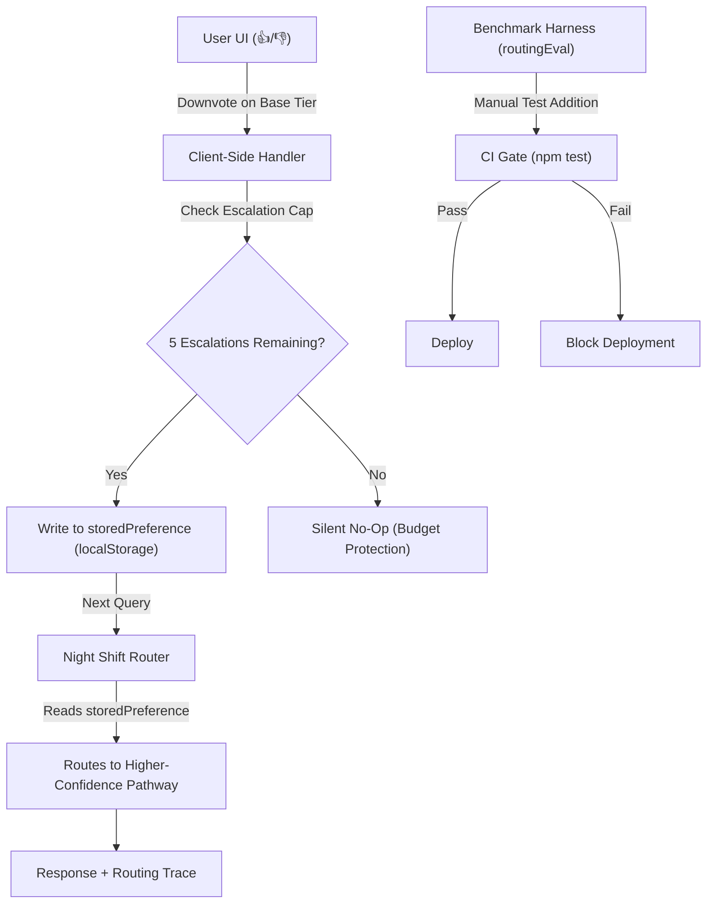

# Feedback Loop Architecture

**How REI learns from user signals to improve routing without manual intervention.**

---

## Architecture

## How It Works

### Step A: Capture the Signal

The user clicks 👍 (helpful) or 👎 (not helpful) on any REI response. These appear as hover-revealed buttons alongside copy/retry in the message card. Only REI messages show feedback buttons — user messages don't.

### Step B: Local Storage Mitigation (Instant)

On 👎 to a non-premium response, the handler writes the current route ID to the `night-shift-user-fingerprint` array in `localStorage`. This array already exists and is read by `getStoredRoutePreference()` in `nightShiftRouter.js:173-185`.

The next time the user sends a query that matches domain-specific signals for that stored route, the router automatically elevates it to a higher-confidence pathway.

**Escalation cap:** Maximum 5 escalations per session. After the cap is reached, further 👎 are silently ignored. This prevents a single user from draining the API budget by downvoting every response. The cap resets on page reload.

### Step C: Automated Benchmark Expansion (Future)

For production deployment:

1. **Cluster & Extract:** Run TF-IDF or vector cosine similarity on downvoted prompts stored in a feedback datastore to identify misrouted keyword patterns.
2. **Benchmark Insertion:** Append offending prompts to `routingEval.test.js` under a new `qualityRegressions` category with guard assertions.
3. **Fingerprint Elevation:** Update `fingerprints.json` `matchTerms` arrays so the router avoids the base tier for that pattern.
4. **Canary Probing:** Route 5% of previously-escalated queries back to base tier periodically. If the base model now handles them correctly (no 👎), release the escalation.

---

## Engineering Constraints

### Adversarial/Subjective Downvoting (Noise)

Users may downvote correct answers they disagree with. The current implementation uses raw user signal — acceptable for an MVP. For production, add a secondary verification step: run the prompt through a lightweight LLM evaluator in the background to confirm the base model's output had logical/syntactic errors before triggering escalation.

### The "Hotel California" Problem

Once a term is elevated to a higher-confidence pathway, it stays there. If the base model receives an update that makes it capable of handling that pattern, the escalation persists unnecessarily.

**Solution (planned, not implemented):** The canary probing mechanism (Step C above) tests 5% of escalated traffic on the base model. If the 👎 rate drops below a threshold, the pattern is released back to the base tier.

### Client-Side Security

Stored preferences live in `localStorage` — client-controlled. The escalation cap (5/session) is a defense, not a guarantee. A determined user can reset the cap by reloading. For production, server-side rate limiting on the `/api/feedback` endpoint would be the correct fix.

---

## Implementation

### Current (Hackathon)

| Component | Status |
|-----------|--------|
| `storedPreference` mechanism | ✅ Exists — `nightShiftRouter.js:155-190` |
| Thumbs up/down UI buttons | ✅ This PR |
| Escalation handler with cap | ✅ This PR |
| Router reads storedPreference | ✅ Already works |
| Manual test case addition | ✅ Via `routingEval.test.js` |

### Future (Post-Hackathon)

| Component | Effort |
|-----------|--------|
| `/api/feedback` backend endpoint | 3-4 hours |
| Feedback datastore (JSON/DB) | 2-3 hours |
| Automated fingerprint update script | 4-6 hours |
| Canary probing mechanism | 6-8 hours |
| LLM evaluator for feedback verification | 8-10 hours |

---

## Terminology

| Internal (code) | External (docs/judges) |
|----------------|------------------------|
| `cheap` pathway | "base tier" — high-throughput, low-cost |
| `medium` pathway | "standard tier" — balanced cost/quality |
| `premium` pathway | "premium tier" — maximal quality |
| `deterministic` pathway | "zero-cost tier" — instant, no API call |
| "forced premium" | "elevated confidence routing" or "user-escalated" |

---

*See also: [DECISIONS.md](./DECISIONS.md) #11 for the escalation cap rationale.*
