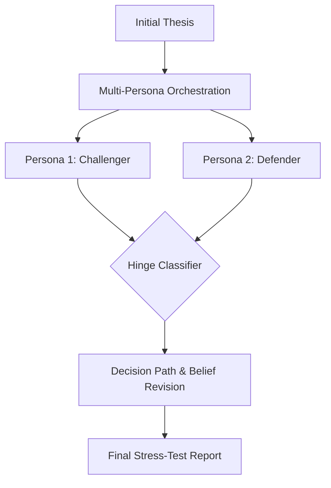

# Debate Furnace — LLM argument stress-tester with reason isolation

**Debate Furnace** is a dialectical stress-testing engine built to identify belief-revision hinges, test the strength of arguments, and automatically generate counter-arguments through multi-persona LLM orchestration.

## Overview

This module runs a dialectical simulation where multiple LLM personas pressure-test a central thesis. It separates reason from emotion, maps the decision paths and historical belief revisions, and isolates the specific "hinges" where an argument succeeds or fails under adversarial pressure.

### Architecture



## The Two Layers of Debate Furnace

To understand this module, it helps to distinguish the **Product UI** from the underlying **Evaluation Methodology**:

1. **The Product / Demo UI (`components.jsx`, `RoundScreen.jsx`, etc.):** The visual interface you see in the REI.ai application. It provides a gamified, real-time look into the debate simulation, showing live text streams, side-by-side persona responses, and belief revision animations. It is a powerful way to demonstrate the concept to end-users.
2. **The Evaluation Methodology (`decisionPath.js`, `classifier.js`, etc.):** The rigorous, headless logic that runs the debate. It is not just a chat interface; it's a structured evaluation harness that systematically classifies arguments ("Hinge Classifier"), isolates emotional manipulation from factual reasoning, and tracks decision paths over multiple rounds to prove *why* an LLM changed its mind. This methodology can be run entirely in the background as an automated evaluation suite.

## Running Instructions

This module is integrated directly into the broader REI.ai architecture. To run the Debate Furnace simulation, start the main application and navigate to the debate module:

```bash
cd ../../.. # Go to rei-ai root
npm install
npm run dev
```

From the UI, select the **Critical Inquirer (Debate)** context and submit a thesis to begin the furnace stress test.
